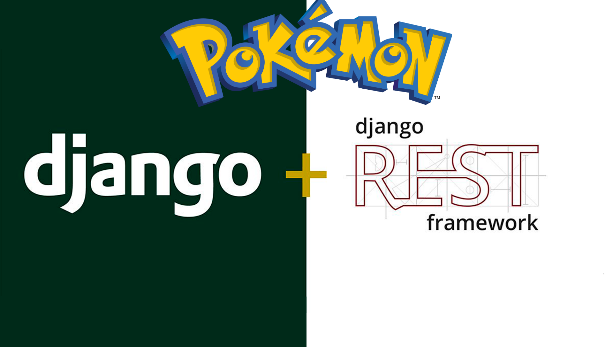

Proyecto Pokemon V0.1 DjangoRest
Autor:Jesus pozzo
# 

## Instalación

1. Clonar este repositorio en tu equipo locas: `https://github.com/jpozzo5/project_pokemon-.git`.
2. Para iniciar nuestro entorno virtual accedemos al proyecto y en la carpera `env_pokemon/Scripts` ejecutamos el comando `source active`.
3. Para mayor informacion en la carpeta del proyecto se encuentra un archivo llamado requerements.txt el cual nos indica cuales son las dependecias utilizadas en este proyecto para instalarlas podemos utilizar el comando
`pip install -r requirements.txt`.
4. La arquitectura de Bases de datos de este proyecto fue armada mediante Posgresql utilizando la libreria psycopg2 la configuracion de la BD : 
```python
DATABASES = {
    'default': {
        'ENGINE': 'django.db.backends.postgresql_psycopg2',
        'NAME': 'pokemon',
        'USER': 'jesus',
        'PASSWORD':'pozzo*',
        'HOST': 'localhost',
        'PORT': '5432',
    }
}
```


5. Ahora podemos realizar la migracion de nuestro proyecto para cargar lo modelos y luego poder cargar los recursos `python manage.py migrate`.
6. Django nos proporciona crear nuestro propios comandos,el cual se han creado 4 para importar los pokemones,localizacion,regiones y areas ,Tomando la informacion de los archivo json en se cuentran en la siguiente ruta `project_pokemon\PokemonApp\management\static` y los comandos en `project_pokemon\PokemonApp\management\commands`.
7. Importar localizacion, acceder a la ruta principal del proyecto  y ejecutar el comando `python manage.py load_data_location`.
8. Importar Regiones, acceder a la ruta principal del proyecto  y ejecutar el comando `python manage.py load_data_regions`.
9.  Importar Areas, acceder a la ruta principal del proyecto  y ejecutar el comando `python manage.py load_data_areas`
10. Importar Pokemones, acceder a la ruta principal del proyecto  y ejecutar el comando `python manage.py load_data_pokemon`


## Servicio Token Seguridad
`login/` Este servicio DJango Nos permite obtener nuestro token de seguridad pera poder ver las vistas que requieran autenticacion. `[POST']`.
Formato :

```python
    {
    "username": "pedro",
    "password": "strong_password"
    }
```
Repuesta :
```python
    { 'token' : '9944b09199c62bcf9418ad846dd0e4bbdfc6ee4b' }
```
## Servicios
1. `pokemons/` muestra un listado de los pokemones `[GET]`.
2. `pokemons/(?P<pk>\d+)` Muestra 1 pokemon de acuerdo a a Id `[GET]`.
3. `pokemons/own/` Muestra Un listado de captura de pokemones y los miembros de la party  `[GET]`.
4. `pokemons/own/` Puedes registra un pokemon capturado con un maximo de 6 miembros en la party `[POST]`.
5. `pokemons/own/` Edita el nick_name del almacenamiento de tu pokemon `[PUT', 'PATCH']`.
6. `pokemons/own/` Elimina El pokemon de tu almacenamiento`[DELETE]`.
7. `locations/` Este Servicio Muestra el listado de loocalizaciones `[Get]`.
8. `regions/` Este Servicio muestra el listado de regiones `[GET]`.
9. `areas/` Este Servicio muestra el listado de areas `[GET]`.


